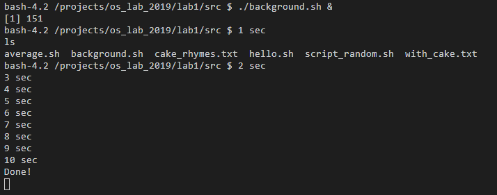
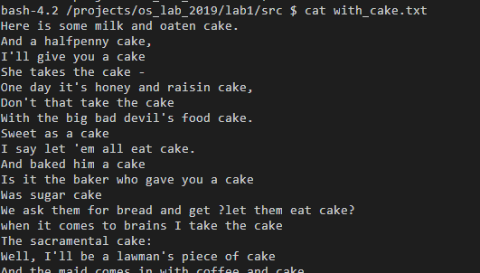
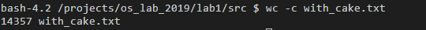
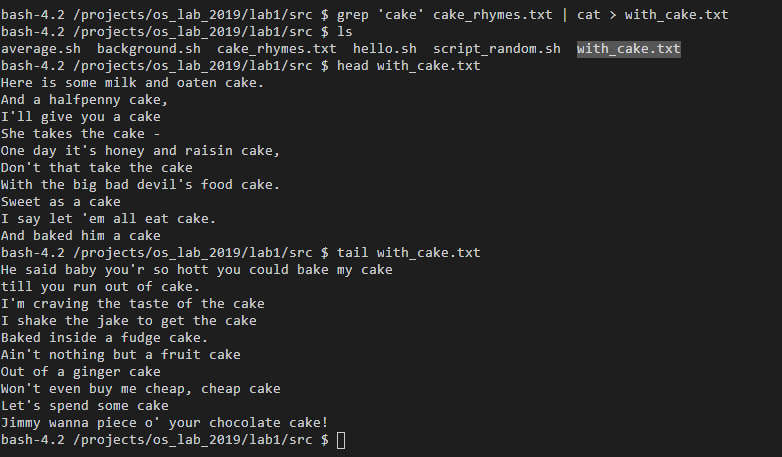
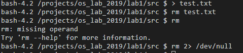
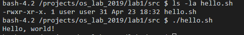
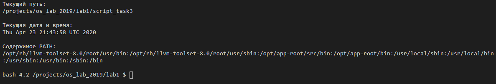
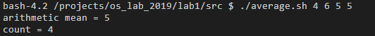

# Лабораторная работа №1

## Задание 1

### Необходимые знания

* `&` в `shell`

> `&` используется для того, чтобы организовать исполнение команд в фоновом режиме

* Как работает команда `cat`

> Выводит содержимое файла

* Как работает команда `clear`

> Очищает терминал

* Как работает команда `wc`

> Подсчет строк, слов и байтов в файле.

### Задание

* Запустите скрипт `background.sh` в фоновом режиме.

* Создайте текстовый файл и выведите его содержимое на экран терминала.

* Очистите окно терминала.

`clear`

* Посчитайте количество символов в файле.

# Задание 2

### Необходимые знания

* Как работает команда `grep`

> ведёт поиск строки в файле, с заданной подстрокой.

* Как работает редирект в `bash`

> Перенаправляет потоки ввода/вывода stdin,stdout,stderr 

* Что такое `pipe` в `bash`

> `pipe`используются для перенаправления потока выходных данных из одной программы на вход в другую.

* Специальные девайсы в *nix системах (`/dev/null`, `/dev/full` и т.д.)

> Нефизические устройства.Предоставляют различные функции, обрабатываемые операционной системой.

>>/ dev / null  - принимает и отбрасывает все записанные в него данные любого объема; обеспечиваетчтение конца файла при чтении.

>>/ dev / zero  - принимает и отбрасывает все записанные в него данные любого объема; создает непрерывный поток нулевых символов в качестве вывода при чтении.

>>/ dev / full  - создает поток нулевых символов при выводе чтении из него и генерирует ошибку ENOSPC ("disk full") при попытке записи в него.

>>/ dev / random - генератор случайных чисел

### Задание

* С помощью команды `grep`, используя `pipe` и редирект (`>`), запишите в файл `with_cake.txt` все строчки из файла `cake_rhymes.txt`, в которых есть слово `cake`.

* Сделайте команду `rm` "тихой", используя редирект в `/dev/null`.

# Задание 3

### Необходимые знания

* Права в linux

>Чтение (r – read) - означает, что файл можно просматривать. 

>Запись (w – write)- позволяет изменять файл, то есть дописывать в него информацию или заменять ее другой.

>Выполнение (x – execution) - позволяет исполнять файл как программу, при этом в файле должны быть записаны инструкции для процессора.

>Первые три записи – это права владельца, вторые три записи – права группы, последняя тройка – права на файл для всех остальных
>> `-rwxr-xr-x. 1 user user   115 Apr 23 18:32 average.sh`

* Команда `chmod`

> Программа для изменения прав доступа к файлам и каталогам.

* Переменные окружения

>Переменные окружения — это специальные переменные, определенные оболочкой и используемые программами во время выполнения.
>Такие переменные могут содержать общие настройки системы, параметры графической или командной оболочки, данные о предпочтениях пользователя и т.д. 
>Переменная окружения может быть трех типов:
>
>>1. Локальные
>    Эти переменные определены только для текущей сессии. 
>
>>2. Пользовательские
>    Эти переменные оболочки загружаются каждый раз когда пользователь входит в систему при помощи локального терминала, или же подключается удаленно.
>
>>3. Системные
>    Эти переменные доступны во всей системе, для всех пользователей.

* Команда `date` в bash
> Показывает системные дату и время

* Что такое `shebang`
> Последовательность из `#!`.Оставшаяся часть после `#!` сообщает ОС, какая программа должна быть запущена, чтобы "выполнить" оставшуюся часть script.
> Используется вначале скриптов `#!/bin/bash`

### Задание

* Сделайте файл `hello.sh` исполняемым, выполните его.

* Напишите `bash` скрипт, который выводит текущий путь, текущую дату и время, а также содержимое переменной окружения `PATH`.

# Задание 4\* (повышенной сложности)

### Необходимые знания

* Как работать с аргументами в `bash` скриптах

>Чтение параметров командной строки
>>`$0`- название скриптах
>>`$1,2..$9`-1,2..9-й параметр
>>`${i}`, i- номер введенного параметра от 10 до ∞
>>`$#`- кол-во аргументов
>>Захват всех параметров, переданных скрипту:
>>`$@`  параметры разбиты на отдельные «слова»
>>`$*`  содержит все параметры, введённые в командной строке, в виде единого «слова»

* Как работает команда `od`

>od - производит преобразование ввода (или файла) в один или несколько форматов, в соответствии с указанными опциями . 
>По умолчанию используется восьмеричный формат

* Специальные устройства в *nix системах

>см. задание 2

* Как работает редирект

> `>` - обзначает перенаправление стандартного потока вывода.Если файла не существует, то он будет создан. Если файл существует, произойдет "перезапись"

> `>>`- обзначает перенаправление стандартного потока вывода.Если файла не существует, то он будет создан. Если файл существует, то вывод добавляется к его содержимому.

### Задание

* Напишите скрипт `average.sh`, который выводит количество и среднее арифмитическое его входных аргументов.

* С помощью `bash` и `dev/random` создайте файл `numbers.txt` из 150 рандомных чисел.

* "Скормите" скрипту `average.sh` значения из файла `numbers.txt`.

Добавление скринов к номерам