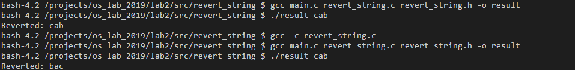

# Лабораторная работа №2

## Задание 1

### Необходимые знания

1. Как менять занчения переменных внутри функций в Си.

> С помощью временной переменной 

### Задание
В папке swap лежит 3 файла: swap.c, swap.h и main.c. Ваша задача закончить метод Swap в swap.c, так, чтобы он менял местами два символа. Скомпилировать программу. Если вы все сделали верно, то программа, которую вы собрали выведет "b a".


## Задание 2

### Необходимые знания

1. Выделение и освобождение памяти в куче Си.

>`malloc()`- выделение необходимого объема памяти
>`free()`-освобождение памяти

2. В чем разница между стеком и кучей (прямо в задании не потребуется, но я спрошу).

>>Стек - это ограниченная область памяти ОП. Используется для локальных переменных, функций.
>>Т.к. стек - это ограниченная область памяти, то вызвав слишком много вложенных функций и / или выделив слишком много места для локальных переменных, можно вызвать переполнение стека.

>>Куча- динамическая память, необходимый объем которой можно выделить и освободить в любой момент.
>>Это требует постоянного контроля того, какие именно части кучи выдёлены или свободны. Из-за этого возможна утечка памяти.

3. Использование аргументов командной строки

>`argc` является количество аргументов командной строки.
>`*argv[]`Массив указателей на символы - это список всех аргументов. argv [0] - это имя программы. Rаждый последующий номер элемента (меньший argc) является аргументом командной строки

### Задание

В папке revert\_string содержатся файлы main.c, revert\_string.h, revert\_string.c. Вам необходимо реализовать метод RevertString в revert_string.c, который должен переворачивать данную пользователем строку.
Изучить код main.c, скомпилировать программу, рассказать, как она работает и, что делает.



## Задание 3

### Необходимые знания

1. Основы работы компилятора: препроцессор, компилятор, линковщик. Их роли и порядок работы.

>

2. Что такое статическая и динамическая линковка. В чем разница?

>

3. Опции компилятора: `-I, -L, -l, -shared, -o, -с, -fPIC`

>

4. Утилита ar.

>архиватор, не использующий сжатия данных. 
>Используется для создания и обновления статических библиотек

5. Переменная окружения `LD_LIBRARY_PATH`

>Переменная среды, в которой перечисляются все каталоги, содержащие пользовательсякие динамические библиотеки.

### Задание

В **задании 2**, вы написали маленькую библиотеку с одной функцией, переворота строки. Тем не менее этот код уже можно переиспользовать, а чтобы это было удобнее делать, его необходимо вынести в библиотеку. Ваше задание скомпилировать статическую и динамическую библиотеки с RevertString и залинковать их в приложения с main.c.

***Получится две программы, первая будет использовать статическую билиотеку, а вторая динамическую.*** 


## Задание 4

### Необходимые знания

3. Переменная окружения `LD_LIBRARY_PATH`

### Задание

Если вы зайдете в update.sh, то увидите, слежующую строчку `sudo apt -y install libcunit1 libcunit1-doc libcunit1-dev`. Это установка в вашу систему библиотеки для юнит тестирования на языке Си - CUnit. В папочке test вы найдете tests.c - готовую программу, которая запускает несколько юнит тестов для функции RevertString. Ваша задача, скомпилировать эту программу с динамической библиотекой из **Задания 3**. Важно, что программа с тестами и программа из **Задания 2** должны использовать одну библиотеку (один файл). 

P.S. Разумеется, тесты должны проходить :)

```

CUnit - A unit testing framework for C - Version 2.1-3
http://cunit.sourceforge.net/


Suite: Suite
  Test: test of RevertString function ...passed

Run Summary:    Type  Total    Ran Passed Failed Inactive
              suites      1      1    n/a      0        0
               tests      1      1      1      0        0
             asserts      4      4      4      0      n/a

Elapsed time =    0.000 seconds
```


### Ресурсы

1. [Как cлинковаться с CUnit.](https://mysnippets443.wordpress.com/2015/03/07/ubuntu-install-cunit/)

## Перед тем, как сдавать

Залейте ваш код в ваш репозиторий на GitHub. Убедитесь, что вы не добавляете в репозиторий бинарные файлы (программы, утилиты, библиотеки и т.д.).

<!--
## Задание 5* (Необязательно, за допополнительные баллы)

###Необходимые знания

1. Как пользоваться интернетом.

###Задание

В папке bin лежит динамическая библиотека libsimple.so. С помощью утилить `objdump` определить, какие функции она содержит.

###Ресурсы

1. [Аргументы коммандной строки для objdump](https://sourceware.org/binutils/docs/binutils/objdump.html)
-->

 
