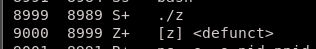
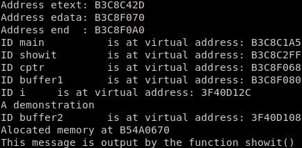
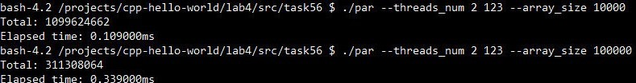
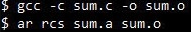

# Лабораторная работа №4

## Задание 1

### Необходимые знания

1. Функция `kill`

> Посылает сигнал к любому процессу или группе процессов с заданным pid

2. Неблокирующий wait c `WNOHANG`

> WNOHANG - опция для waitpid, возвращающая управление в случае, когда ни один из процессов не закончил выполнение.

3. Функция `alarm`, сигнал `SIGALRM`, функция `signal`.

> alarm - задаёт таймер (в секундах), после которого посылается сигнал SIGALRM в процесс. 
> Для обработки сигнала используется функция signal, принимает два аргумента - сигнал и указатель на функцию.

Дополнить программу parallel\_min\_max.c из ***лабораторной работы №3***, так чтобы после заданного таймаута родительский процесс посылал дочерним сигнал SIGKILL. Таймаут должен быть задан, как именной необязательный параметр командной строки (`--timeout 10`). Если таймаут не задан, то выполнение программы не должно меняться.

### Ресурсы

1. [Системный вызов kill](http://man7.org/linux/man-pages/man2/kill.2.html)
2. [Системный вызов waitpid. Здесь информация о WNOHANG](https://linux.die.net/man/2/waitpid)
3. [Системный вызов signal](http://man7.org/linux/man-pages/man2/signal.2.html)
4. [Системный вызов alarm](http://man7.org/linux/man-pages/man2/alarm.2.html)

## Задание 2

### Необходимые знания

1. Что такое зомби процессы, как появляются, как исчезают.

> Процесс-зомби - процесс, который завершился, но его не удалили. 
> Такие процессы появляются в случае, если завершение работы дочернего процесса не было "обработано" функцией `wait` в родителе. 
>Пока процесс-зомби не "убит", он занимает место в таблице процессов.
> Если она будет переполнена, то нельзя будет создавать новые процессы от лица текущего пользователя. 
>Если программа завершается не удалив процессы-зомби, то это сделает процесс init, удаляющий все свои дочерние процессы.

Создать программу, с помощью которой можно продемонстрировать зомби процессы. Необходимо объяснить, как появляются зомби процессы, чем они опасны, и как можно от них избавиться.

### Ресурсы

1. [Немного теории по зомби процессам](https://www-cdf.fnal.gov/offline/UNIX_Concepts/concepts.zombies.txt)

## Задание 3

### Необходимые знания

1. Работа виртуальной памяти.

>Программе выделяется определенный объём виртуальной памяти, в котором размещаются стек, куча и исполняемый код.
>При обращении к адресу в виртуальной памяти происходит "подмена" адреса на физический , после чего получается доступ к нужному участку памяти. 
>Gомогает защитить данные одной программы от вмещательства извне и упростить работу с физической памятью. 

Скомпилировать process_memory.c. Объяснить, за что отвечают переменные `etext`, `edata`, `end`.

>`etext` - возвращает первый адрес в виртуальной памяти за концом кода
>`edata` - возвращает первый адрес в виртуальной памяти за концом участка с инициализированными статическими переменными
>`end` - возвращает первый адрес в виртуальной памяти за концом участка с неинициализированными статическими переменными

### Ресурсы

1. [etext, edata, end](https://linux.die.net/man/3/edata)
2. [Неплохая статья (перевод), про то, как устроена память](https://habrahabr.ru/company/nixsolutions/blog/277759/)

## Задание 4

Создать makefile, который собирает программы из задания 1 и 3.
> task14,task34
## Задание 5

### Необходимые знания

1. POSIX threads: как создавать, как дожидаться завершения.

>Создавать: pthread_t <имя>[<число_нитей>]
>Дожидаться завершения: pthread_join(<id_нити>, <возвращаемое_значение_потока>)

2. Как линковаться на бибилотеку `pthread`

>`-lpthread`

Доработать parallel_sum.c так, чтобы:

* Сумма массива высчитывалась параллельно.
* Массив генерировался с помощью функции `GenerateArray` из ***лабораторной работы №3***.
* Программа должна принимать входные аргументы: количество потоков, seed для генерирования массива, размер массива (`./psum --threads_num "num" --seed "num" --array_size "num"`). 
* Вместе с ответом программа должна выводить время подсчета суммы (генерация массива не должна попадать в замер времени).

* Вынести функцию, которая считает сумму в отдельную библиотеку.

### Ресурсы

1. [Туториал по POSIX threads от университета Карнеги-Меллона (в этой лабе вам нужно только начало)](https://www.cs.cmu.edu/afs/cs/academic/class/15492-f07/www/pthreads.html#SCHEDULING)
2. [Как можно мерить время (кстати в 3й лабораторной работе тоже есть пример)](https://www.gnu.org/software/libc/manual/html_node/Elapsed-Time.html)

## Задание 6

Создать makefile для parallel_sum.c.
>task5
## Перед тем, как сдавать

Залейте ваш код в ваш репозиторий на GitHub. Убедитесь, что вы не добавляете в репозиторий бинарные файлы (программы, утилиты, библиотеки и т.д.).

