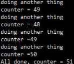
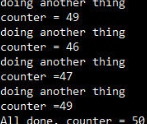
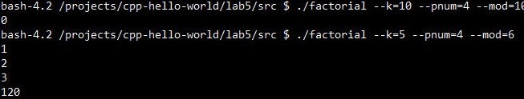

# Лабораторная работа №5

## Задание 1

### Необходимые знания

1. Компилирование программ с помощью gcc.
>>Расмотренно в предыдущих лабах
2. Состояние гонки.

>Состояние гонки — 2 процесса (потока) пытаются одновременно получить доступ к одной ячейке памяти.

3. Критическая секция.

>Критическая секция — секция, в которой все переменные, к которой пытается получить доступ данный поток, не могут быть изменены/прочитаны другими потоками во избежание состояния гонки.

4. POSIX threads: как создавать, как дожидаться завершения.

>>Расмотренно в предыдущих лабах

5. Как линковаться на бибилотеку `pthread`

>>Расмотренно в предыдущих лабах

Скомпилировать mutex.c без использования и с использованием мьютекса. Объяснить разницу в поведении программы.

При запуске программы происходит "Состояние гонки"
С мьютексом такого не происходит

### Ресурсы

1. [Туториал по POSIX threads от университета Карнеги-Меллона](https://www.cs.cmu.edu/afs/cs/academic/class/15492-f07/www/pthreads.html#SCHEDULING)
2. [Статья о Race condition [wikipedia]](https://en.wikipedia.org/wiki/Race_condition)
3. [Статья о Critical Section [wikipedia]](https://en.wikipedia.org/wiki/Critical_section)

## Задание 2

### Необходимые знания

1. POSIX threads: как создавать, как дожидаться завершения.
>>Расмотренно в предыдущих лабах
2. Как линковаться на бибилотеку `pthread`
>>Расмотренно в предыдущих лабах
3. Как использовать мьютексы.

>Сперва нужно инициализировать мьютекс.
>Затем в нужном месте мьютекс блокируется вызовом pthread_mutex_lock; и разблокируется при выходе из критической секции командой pthread_mutex_unlock;

Написать программу для паралелльного вычисления факториала по модулю `mod` (`k!`), которая будет принимать на вход следующие параметры (пример: `-k 10 --pnum=4 --mod=10`):

1. `k` - число, факториал которого необходимо вычислить.
2. `pnum` - количество потоков.
3. `mod` - модуль факториала

Для синхронизации результатов необходимо использовать мьютексы.

### Ресурсы

1. [Туториал по POSIX threads от университета Карнеги-Меллона](https://www.cs.cmu.edu/afs/cs/academic/class/15492-f07/www/pthreads.html#SCHEDULING)

## Задание 3

### Необходимые знания

1. Состояние deadlock

>>Тупик. состояние, при котором каждый поток ожидает на освобождение одного из ресурсов, а все ресурсы при этом захвачены.

Напишите программу для демонстрации состояния deadlock.
>src/deadlock.c

### Ресурсы

1. [Статья о deadlock [wikipedia]](https://en.wikipedia.org/wiki/Deadlock)

## Перед тем, как сдавать

Залейте ваш код в ваш репозиторий на GitHub. Убедитесь, что вы не добавляете в репозиторий бинарные файлы (программы, утилиты, библиотеки и т.д.).

