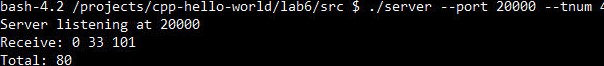
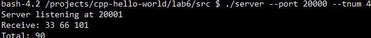
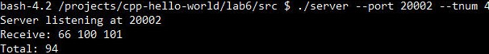
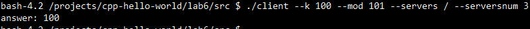

# Лабораторная работа №6

## Задание 1

### Необходимые знания

1. TCP и TCP/IP

>`TCP` — распространенный стандартный протокол передачи данных по сети, при работе с которым перед передачей данных необходимо установить соединение, а каждый передаенный по этому протоколу пакет сопровождается служебной информацией. 

>`TCP/IP` - стек протоколов, состоящий из 4 уровней.
> Прикладной уровень - на этой уровне работает большинство приложений. Пример протоколов: `HTTP`, `FTP`, `DNS`
> Транспортный уровень - определеют, для какого приложения предназначены данные. Пример протоколов: `TCP`, `UDP`
> Сетевой - предназначен для передачи между "сетями". Тут работабют маршрутизаторы. 
> Канальный - "физический уровень", описывает способ кодирования данных. Пример: `Ethernet`

2. TCP vs UDP

>TCP - осуществляет целостную передачу пакетов. 

>UDP - осуществляет более быструю передачу, однако пакеты могут теряться/приходить в разном порядке. Скорость передачи данных у данного протокола высокая
3. Системный вызов `socket` 
> Создаётся новый неименованный сокет и возвращается его дескрипторю.
>Первый аргумент - тип домена (`AF_IPNET - IPv4`) 
>Второй аргумент - тип протокола (`SOCK_STREAM - TCP`, `SOCK_DGRAM - UDP`), третий зависит от протокола.

4. Системный вызов `bind`
> Создаёт сокет используя IP и port.

5. Системный вызов `listen`
> функция, которая переводит сокет в режим ожидания соединения. Запросы помещаются в очередь и обрабатываются по одному.

6. Системный вызов `accept`
> Инициализирует соединение, создавая новый сокет.

7. Системный вызов `recv`
> Получает сообщение от сокета.

8. Системный вызов `send`
> Передает сообщение другому сокету.

9. Системный вызов `close`
> функция, закрывающая файловый дескриптор. В случае сокета удаляется он сам.

10. Системный вызов `connect`
> функция для создания соединения между двумя сокетами. 
В предыдущей лабораторной работе вы распаралелливали вычисление факториала по модулю с помощью потоков. В этой работе вы пойдете еще дальше: вы распараллелите эту работу еще и между серверами. 

Необходимо закончить `client.c` и `server.c`:

Клиент в качетсве аргументов командной сроки получает `k`, `mod`, `servers`, где `k` это факториал, который необходимо вычислить (`k! % mod`), `servers` это путь до файла, который содержит сервера (`ip:port`), между которыми клиент будет распараллеливать соединения.

Сервер получает от клиента "кусок" своих вычислений и `mod`, в ответ отсылает клиенту результат этих вычислений.

### Ресурсы

1. [Manual pages](http://man7.org/linux/man-pages/)
2. [TCP [Wikipedia]](https://en.wikipedia.org/wiki/Transmission_Control_Protocol)

### Заметка

Обратите внимание, что клиент сейчас дожидается завершения работы с каждым сервером в цикле, т.е. последовательно. Это значит, что вам нужно подумать, как распараллелить работу с каждым сервером, чтобы сервера могли работать параллельно. Есть несколько вариантов, как это можно сделать, опираясь на уже пройденный вами материал, никто вас не ограничивает в выборе способа, но выбранный вариант вам необходимо объяснить.

>>>Клиенту на вход подаётся кол-во серверов и он создаёт равное кол-во потоков, которые работают с серверами.

## Задание 2

Создать makefile для программ клиента и сервера

>см. makefile

## Задание 3

Найти дублирующийся код в двух приложениях и вынести его в библиотеку. Добавить изменения в makefile.

см. makefile

## Задание 4 (опционально)

Получить доступ из внешнего мира. Преподаватель может попросить вас объединиться с другим студентом, чтобы проденмонстрировать, как будет работать ваш сервер с чужим клиентом. Для этого в Codenvy зайдите в Servers (Dashboard->Workspace->Servers), добавьте порт, на котором будет висеть ваш сервер, презагрузите workspace на этой же вкладке браузера. Рядом с созданным "сервером" вы должны увидеть "белый" адрес, по которому вы можете обратиться к вашему серверу. 

## Перед тем, как сдавать

Залейте ваш код в ваш репозиторий на GitHub. Убедитесь, что вы не добавляете в репозиторий бинарные файлы (программы, утилиты, библиотеки и т.д.).
